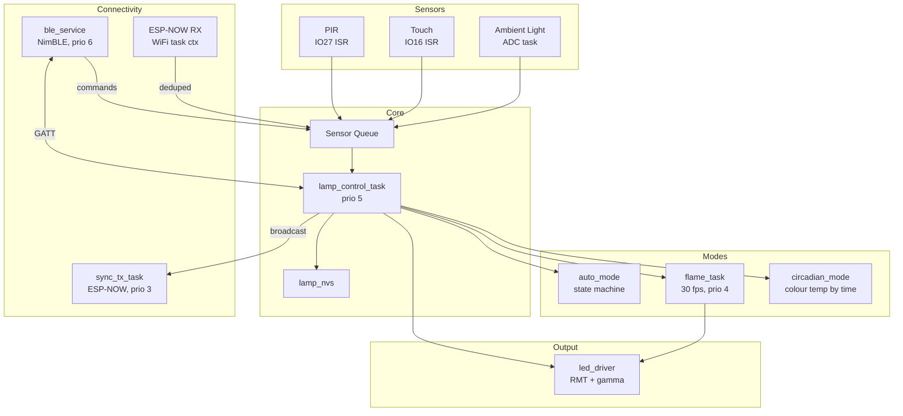
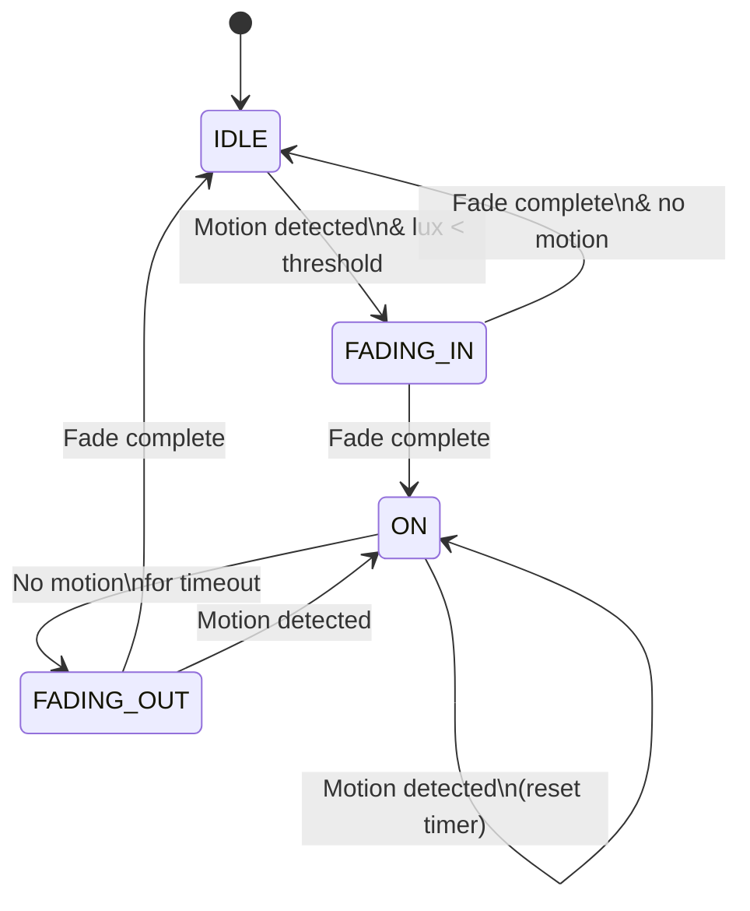
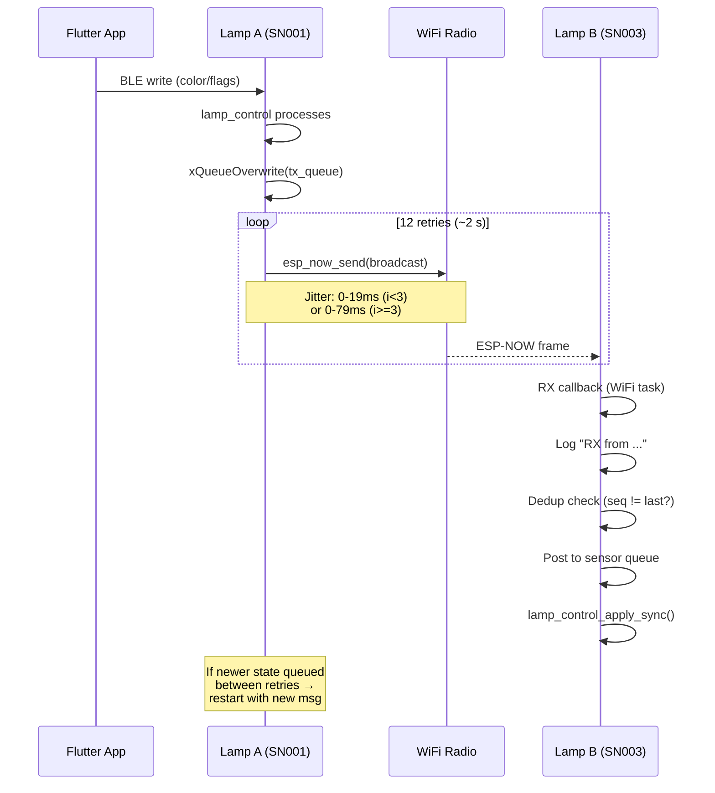

# Smart Lamp Firmware

ESP-IDF firmware for the Smart Lamp, a tunable-white LED desk lamp built around the ESP32-WROOM-32D. Controls 31 SK6812WWA LEDs (warm/neutral/cool channels), reads PIR motion and ambient light sensors, drives an automatic lighting mode, runs a flame animation, and exposes everything over BLE GATT for the companion Flutter app.

## Hardware

| Component | Part | GPIO |
|-----------|------|------|
| LEDs | 31x SK6812WWA (WWA = Warm / Neutral / Cool) | IO19 (RMT) |
| PIR sensor | BM612 | IO27 (signal), IO25 (sensitivity via DAC) |
| Touch sensor | AT42QT1010 capacitive | IO16 (output), IO13 (pad) |
| Ambient light | Phototransistor + 5K pull-up | IO17 (ADC1 CH7) |

The 31 LEDs are arranged in a 7-row oval grid (up to 5 columns wide). The physical layout is defined in `components/led_driver/led_layout.c`.

## Architecture



### FreeRTOS Tasks

| Task | Priority | Stack | Core | Purpose |
|------|----------|-------|------|---------|
| `lamp_control_task` | 5 | 4096 | 0 | Main event loop: sensor events, touch, BLE commands |
| `flame_task` | 4 | 4096 | 0 | 30 fps animation; created/deleted on mode switch |
| `sync_tx_task` | 3 | 3072 | 1 | ESP-NOW broadcast with jittered retries |
| `sensor_adc_task` | 3 | 2048 | 0 | 1 s ambient light ADC polling |
| NimBLE host | 6 | 4096 | 0 | Internal BLE stack |

### Component Details

**led_driver** -- Drives 31 SK6812WWA LEDs via the RMT peripheral on IO19. Custom NZR encoder (T0H = 300 ns, T1H = 600 ns, T0L = 900 ns, T1L = 300 ns, reset >= 80 us). Applies gamma 2.2 correction and master brightness scaling before each flush. The framebuffer is mutex-protected for thread safety.

**sensor** -- PIR motion detection via GPIO ISR on IO27 (both edges). Touch via polling on IO16 (20 ms interval, integrating debounce requiring 5 consecutive identical samples = 100 ms) with software timer discriminating short press (< 1 s, toggles on/off) from long press (>= 3 s, starts BLE advertising). Ambient light via ADC1 on IO17, sampled every 1 s with a 5-sample median filter, mapped to 0-100 (inverted: high voltage = dark). IO25 DAC controls PIR sensitivity (0-31 range mapped to DAC output). All events are posted to a shared FreeRTOS queue consumed by `lamp_control`.

**lamp_nvs** -- Wraps ESP-IDF NVS for persistent storage. Stores up to 16 scenes (`scene_00` - `scene_15`), 7 schedules, auto mode config, flame mode config, active LED state, and current mode. Writes are debounced (2 s timer) to reduce flash wear from slider changes.

**auto_mode** -- State machine driven by sensor events (see diagram below). Configurable lux threshold, timeout, dim level, and dim duration. Transitions are driven by sensor events fed through `auto_mode_process_event()`.

**circadian_mode** -- Automatically adjusts the warm/neutral/cool colour balance based on time of day. Blends from warm (evening) through neutral (midday) to cool (morning). Runs as a periodic check within `lamp_control_task`.

**flame_mode** -- Creates a dedicated 30 fps FreeRTOS task. Simulates a candle with a 2D Gaussian hot-spot that random-walks across the LED grid (Box-Muller RNG via `esp_random()`). A global flicker oscillator modulates overall brightness. Per-LED intensity is computed as `exp(-d^2 / 2*sigma^2)` from each LED's distance to the hot-spot center. All parameters (drift, radius, flicker depth/speed, brightness) are adjustable at runtime via BLE.

**ble_service** -- NimBLE-based BLE peripheral advertising as `SmartLamp-XXXX` (last 4 hex digits of MAC). Just Works bonding, 512-byte MTU. Defines a custom GATT service (`F000AA00-0451-4000-B000-000000000000`) with 16 characteristics (see table below). BLE writes post events to a queue; `lamp_control` consumes them. LED State notifications are rate-limited to 10 Hz; Sensor Data notifies on motion change and every 5 s.

**lamp_ota** -- Two-partition OTA using `esp_ota_begin/write/end`. The app receives firmware chunks over BLE (OTA Data characteristic) and streams them to the inactive OTA partition. On success the device reboots into the new firmware. On boot, `lamp_ota_check_rollback()` validates the running image and rolls back if it was marked pending verification.

**esp_now_sync** -- ESP-NOW group synchronisation over WiFi channel 1 (see sync flow diagram below). Lamps with the same group ID (1-255, 0 = disabled) broadcast a 31-byte packed state message on every local change. Transmission uses 12 retries with front-loaded jittered gaps over ~2 s. The first 3 retries use tight jitter (0-19 ms) for fast delivery; later retries use wider jitter (0-79 ms) to decorrelate from periodic BLE events. RX deduplication skips repeated sequence numbers before posting to the sensor queue. The TX task checks for newer queued messages between retries and restarts with the latest state if found.

**lamp_control** -- Central event loop running as a FreeRTOS task. Consumes sensor events from the shared queue, dispatches touch actions (short tap = on/off toggle, long press = BLE advertising), manages mode switching (manual/auto/flame/circadian), and routes BLE commands to the appropriate subsystem. Handles ESP-NOW sync events atomically via `lamp_control_apply_sync()`. Restores saved state from NVS on boot.

## Auto Mode State Machine



## ESP-NOW Sync Flow



## BLE GATT Characteristics

| Characteristic | UUID suffix | Properties | Size |
|---------------|-------------|------------|------|
| LED State | AA01 | Read, Write, Notify | 4 B |
| Mode | AA02 | Read, Write | 1 B |
| Auto Config | AA03 | Read, Write | 6 B |
| Scene Write | AA04 | Write | variable |
| Scene List | AA05 | Read, Notify | variable |
| Schedule Write | AA06 | Write | 6 B |
| Schedule List | AA07 | Read, Notify | variable |
| Sensor Data | AA08 | Read, Notify | 3 B |
| OTA Control | AA09 | Write | 1 B |
| OTA Data | AA0A | Write No Rsp | variable |
| PIR Sensitivity | AA0B | Read, Write | 1 B |
| Flame Config | AA0C | Read, Write | 7 B |
| Device Info | AA0D | Read | variable |
| Sync Config | AA0E | Read, Write | 7 B |
| Lamp Name | AA0F | Read, Write | variable |
| Time Sync | AA10 | Write | 4 B |

Service UUID: `F000AA00-0451-4000-B000-000000000000`

## Partition Table

```
nvs,       data, nvs,  0x9000,   0x6000    # 24 KB
otadata,   data, ota,  0xf000,   0x2000    #  8 KB
phy_init,  data, phy,  0x11000,  0x1000    #  4 KB
ota_0,     app,  ota_0,0x20000,  0x1C0000  # 1.75 MB
ota_1,     app,  ota_1,0x1E0000, 0x1C0000  # 1.75 MB
```

Current firmware binary is ~967 KB, within the 1.75 MB OTA slot.

## Building

### Prerequisites

- [ESP-IDF v5.3](https://docs.espressif.com/projects/esp-idf/en/v5.3/esp32/get-started/)

### Build & Flash

```bash
# Source ESP-IDF environment
. ~/esp/esp-idf/export.sh

# Build
cd Firmware
idf.py build

# Flash (adjust port as needed)
idf.py -p /dev/ttyUSB0 flash monitor
```

### Key sdkconfig Options

The `sdkconfig.defaults` file sets:
- Target: ESP32, 4 MB flash @ 80 MHz
- BLE-only mode (no classic BT) via NimBLE
- 1 max BLE connection, 512-byte MTU
- Custom partition table with OTA rollback enabled
- FreeRTOS tick rate: 1000 Hz
- Compiler optimization: size (`-Os`)
