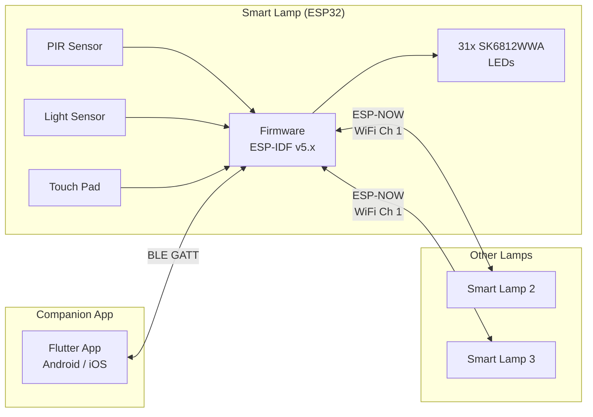

# Smart Lamp

A tunable-white LED desk lamp with motion sensing, ambient light detection, flame animation, and multi-lamp sync. Built on the ESP32, controlled via a Flutter app over BLE, with ESP-NOW mesh synchronisation between lamps.

## Features

- **Tunable white** -- 31 SK6812WWA LEDs with independent warm, neutral, and cool channels
- **Auto mode** -- Motion-activated lighting with ambient light thresholds and configurable timeouts
- **Flame mode** -- 30 fps candle-flicker animation with 2D Gaussian hot-spot random walk
- **Circadian mode** -- Automatic colour temperature adjustment based on time of day
- **Group sync** -- Lamps mirror each other's state over ESP-NOW (98% delivery, ~1 s median latency)
- **Scenes & schedules** -- Save up to 16 scenes, schedule 7 time-based triggers
- **OTA updates** -- Stream firmware over BLE from the companion app
- **Capacitive touch** -- Short tap toggles on/off, long press starts BLE pairing

## System Architecture



## Repository Structure

```
Smart Lamp/
  Firmware/       ESP-IDF firmware for ESP32
  Software/       Flutter companion app
  Tools/          Python test harness & benchmarks
  spec.md         Full product specification
```

See the component READMEs for details:
- [Firmware](Firmware/README.md) -- ESP-IDF architecture, tasks, BLE GATT protocol, build instructions
- [Software](Software/README.md) -- Flutter app architecture, state management, navigation
- [Tools](Tools/README.md) -- Automated sync test suite and A/B benchmark tool

## Hardware

| Component | Part | GPIO |
|-----------|------|------|
| MCU | ESP32-WROOM-32D (4 MB flash) | -- |
| LEDs | 31x SK6812WWA (Warm / Neutral / Cool) | IO19 (RMT) |
| PIR sensor | BM612 | IO27 (signal), IO25 (DAC sensitivity) |
| Touch sensor | AT42QT1010 capacitive | IO16 (output), IO13 (pad) |
| Ambient light | Phototransistor + 5K pull-up | IO17 (ADC1 CH7) |

## Quick Start

### Build Firmware

```bash
. ~/esp/esp-idf/export.sh
cd Firmware
idf.py build
idf.py -p /dev/ttyUSB0 flash monitor
```

### Run Flutter App

```bash
cd Software/smart_lamp
flutter pub get
flutter run
```

### Run Sync Tests

```bash
cd Tools
python3 test_sync.py          # All 19 tests
python3 bench_sync.py --label run1  # Benchmark with JSON output
```
