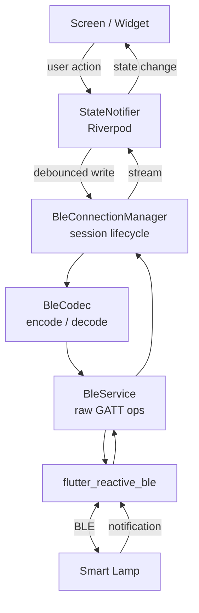
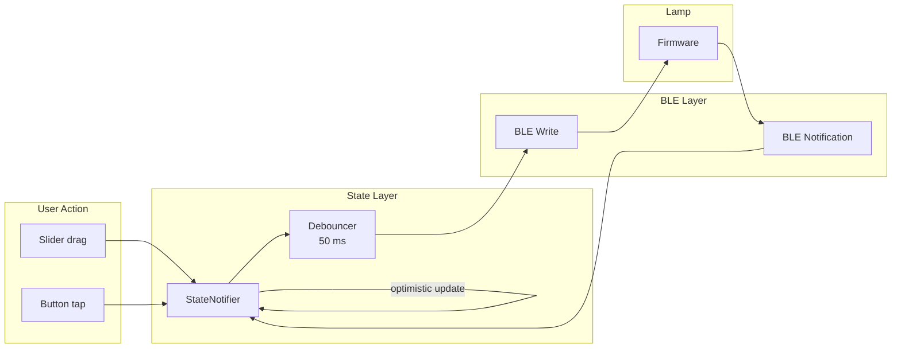
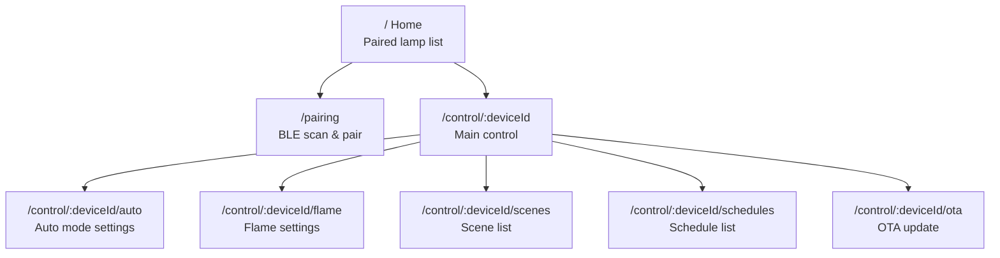

# Smart Lamp App

Flutter companion app for the Smart Lamp. Connects over BLE to discover, pair, and control the lamp -- adjusting color temperature, brightness, mode, scenes, schedules, flame animation, and firmware updates.

## Screenshots

*Coming soon -- the app uses a Material 3 dark theme with an amber color seed.*

## Features

- **Device discovery & pairing** -- Scans for nearby Smart Lamp devices advertising the custom BLE service. Paired lamps are persisted locally.
- **Manual control** -- Three independent channel sliders (warm, neutral, cool) plus a master brightness slider. Changes are debounced and sent over BLE in real time.
- **Auto mode** -- PIR + ambient light driven automatic lighting. Configure lux threshold, motion timeout, dim level, and dim duration. Live sensor readout (lux + motion state) displayed in the settings screen.
- **Flame mode** -- Candle-flicker animation running at 30 fps on the lamp. Five sliders control intensity, drift (calm to wild), radius (focused to diffuse), flicker depth, and flicker speed. A live grid preview shows approximate LED output.
- **Circadian mode** -- Automatic colour temperature adjustment based on time of day.
- **Scenes** -- Save the current LED state as a named scene (up to 16). Apply or delete saved scenes from the scene list. Applying a scene switches to manual mode.
- **Schedules** -- Up to 7 time-based triggers. Each schedule specifies days of the week, time, and which scene to activate. Schedules are stored on the lamp.
- **Group sync** -- Assign lamps to a sync group (1-255) so they mirror each other's state over ESP-NOW. Configure via the Group Sync screen.
- **Lamp naming** -- Assign a custom name to each lamp, stored on-device in NVS.
- **OTA firmware updates** -- Pick a `.bin` file from the device, stream it to the lamp over BLE, and monitor progress. The lamp reboots into the new firmware automatically.

## Architecture

```
lib/
  main.dart                     Entry point, ProviderScope, MaterialApp.router
  app_router.dart               GoRouter: /, /pairing, /control/:deviceId/...
  |
  ble/
    ble_uuids.dart              GATT service & characteristic UUID constants
    ble_codec.dart              Encode/decode payloads for all 15 characteristics
    ble_service.dart            Low-level flutter_reactive_ble wrapper
    ble_connection_manager.dart Session lifecycle, initial reads, notification routing
  |
  models/
    lamp_state.dart             LedState (warm, neutral, cool, master)
    auto_config.dart            AutoConfig (timeout, lux threshold, dim %, dim duration)
    flame_config.dart           FlameConfig (drift, radius, flicker, brightness)
    scene.dart                  Scene (index, name, color channels)
    schedule.dart               Schedule (days, time, scene index, enabled)
    sensor_data.dart            SensorData (lux, motion)
    bonded_lamp.dart            BondedLamp (id, name, persisted locally)
  |
  providers/
    ble_provider.dart           FlutterReactiveBle singleton, BleService, ConnectionManager
    lamp_state_provider.dart    LedState + LampMode state notifiers (debounced BLE writes)
    auto_config_provider.dart   AutoConfig state notifier
    flame_config_provider.dart  FlameConfig state notifier
    scene_provider.dart         Scene list state notifier
    schedule_provider.dart      Schedule list state notifier
    sensor_data_provider.dart   SensorData stream provider
    ota_provider.dart           OTA progress state notifier
    device_list_provider.dart   Paired lamp list (SharedPreferences-backed)
  |
  screens/
    home_screen.dart            Paired lamp list, add/remove devices
    pairing_screen.dart         BLE scan results, tap to pair
    control_screen.dart         Mode picker, channel sliders, bottom nav
    auto_settings_screen.dart   Auto mode config + live sensor readout
    flame_screen.dart           Flame parameter sliders + grid preview
    scenes_screen.dart          Scene list with apply/delete
    schedules_screen.dart       Schedule list with day picker + time picker
    ota_screen.dart             File picker + progress bar for firmware update
  |
  widgets/                      Reusable UI components (sliders, cards, pickers)
  storage/                      SharedPreferences wrapper for bonded lamp list
  theme/                        Material 3 dark theme, amber seed color
  utils/                        Timer-based debouncer (50 ms default)
```

### BLE Communication

The BLE layer is a three-tier stack that separates transport, encoding, and session management:



1. **BleService** (`ble_service.dart`) -- Thin wrapper around `flutter_reactive_ble`. Handles scanning, connecting, MTU negotiation, and raw read/write/subscribe operations.

2. **BleCodec** (`ble_codec.dart`) -- Serializes and deserializes all 15 GATT characteristic payloads. Little-endian byte encoding matching the firmware's wire format.

3. **BleConnectionManager** (`ble_connection_manager.dart`) -- Manages the full connection lifecycle: connect, negotiate MTU (512), read initial state for all characteristics, subscribe to notifications (LED state, sensor data, scene list, schedule list, OTA status), and broadcast connection state changes.

### State Management

The app uses [Riverpod](https://riverpod.dev/) for state management. Each lamp subsystem has its own `StateNotifier`:



1. Reads initial state from the lamp during BLE connection setup
2. Optimistically updates local state on user interaction
3. Debounces writes to the lamp over BLE (50 ms default)
4. Listens to BLE notifications for external state changes

### Navigation

[GoRouter](https://pub.dev/packages/go_router) with nested routes:



## Getting Started

### Prerequisites

- [Flutter SDK](https://docs.flutter.dev/get-started/install) (3.11+)
- Android Studio or Xcode for platform builds
- A physical device with BLE (emulators don't support BLE)

### Build & Run

```bash
cd Software/smart_lamp

# Install dependencies
flutter pub get

# Run on connected device
flutter run
```

### Platform Permissions

**Android** (configured in `android/app/src/main/AndroidManifest.xml`):
- `BLUETOOTH`, `BLUETOOTH_ADMIN` (API <= 30)
- `BLUETOOTH_SCAN`, `BLUETOOTH_CONNECT` (API 31+)
- `ACCESS_FINE_LOCATION` (required for BLE scanning on older Android)
- Min SDK: 21

**iOS** (configured in `ios/Runner/Info.plist`):
- `NSBluetoothAlwaysUsageDescription`
- `NSBluetoothPeripheralUsageDescription`

### Dependencies

| Package | Purpose |
|---------|---------|
| flutter_reactive_ble | BLE scanning, connection, GATT operations |
| flutter_riverpod | State management |
| go_router | Declarative routing with path parameters |
| shared_preferences | Local persistence for paired lamp list |
| permission_handler | Runtime BLE/location permission requests |
| file_picker | OTA firmware file selection |
