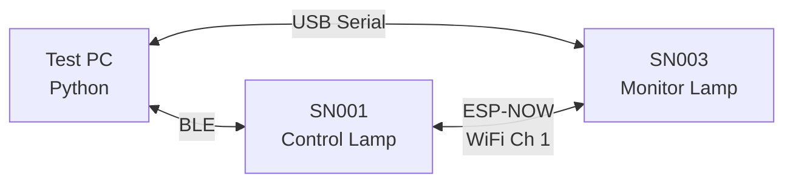
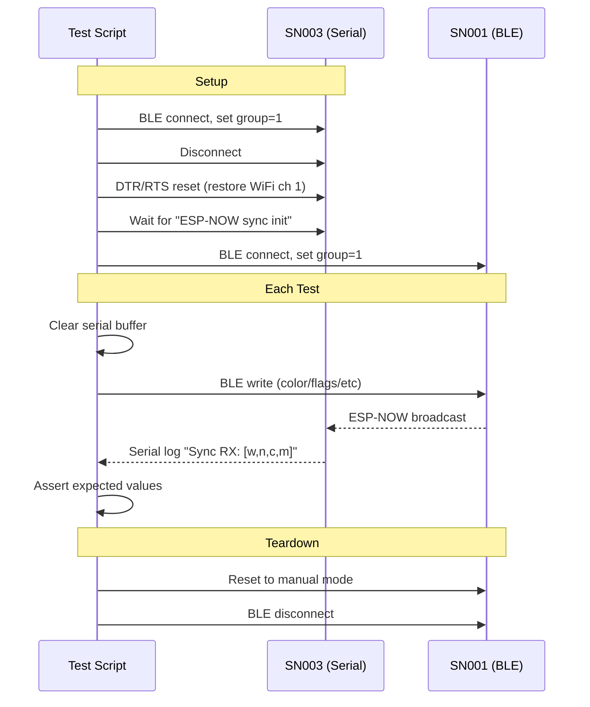

# Smart Lamp Tools

Python utilities for testing and benchmarking the Smart Lamp firmware's ESP-NOW group sync.

## Test Setup

Two lamps are required: one controlled via BLE (SN001), one monitored via USB serial (SN003).



### Prerequisites

- Python 3.10+
- `bleak` (BLE library): `pip install bleak`
- `pyserial`: `pip install pyserial`
- SN001 reachable via BLE
- SN003 connected via USB serial (`/dev/ttyUSB0`)

### Configuration

Edit the constants at the top of `lamp_test.py`:

```python
SN001_MAC = "C4:4F:33:11:AA:9F"   # Control lamp (BLE)
SN003_MAC = "30:AE:A4:07:6B:6A"   # Monitor lamp (BLE, for setup only)
SERIAL_PORT = "/dev/ttyUSB0"       # Monitor lamp (serial)
```

## Files

| File | Purpose |
|------|---------|
| `lamp_test.py` | Reusable library: `LampBLE` (async BLE control) + `SerialMonitor` (threaded serial log capture) |
| `test_sync.py` | Automated test suite (19 test functions) |
| `bench_sync.py` | A/B benchmark tool with JSON persistence and comparison |

---

## ESP-NOW Sync Test Suite

### How It Works



### Usage

```bash
cd Tools

# Run all tests
python3 test_sync.py

# Run specific test(s)
python3 test_sync.py test_color_sync test_on_off_sync

# Verbose mode (shows all serial output)
python3 test_sync.py --verbose

# List available tests
python3 test_sync.py --list
```

### Test Cases

| Test | What it verifies |
|------|-----------------|
| `test_color_sync` | Color change on SN001 propagates to SN003 |
| `test_on_off_sync` | On/off toggle propagates `lamp_on` state (2 sub-tests) |
| `test_flags_sync` | AUTO and FLAME mode flag changes propagate (2 sub-tests) |
| `test_circadian_flag_sync` | CIRCADIAN flag change propagates |
| `test_full_scene_sync` | Full scene parameters (color + brightness) propagate |
| `test_rapid_changes` | Multiple rapid changes converge to final state |
| `test_group_isolation` | SN003 (group 1) ignores broadcasts from SN001 (group 2) |
| `test_sync_latency` | Measures single-change sync latency (5 trials) |
| `test_rapid_convergence_time` | Measures how long rapid changes take to converge |
| `test_soak_reliability` | 50-iteration delivery rate (pass threshold: 70%) |
| `test_rapid_burst` | 20 rapid changes, verify convergence within 15 s |
| `test_per_retry_delivery_rate` | Count how many of 12 TX retries physically arrive |
| `test_on_off_rapid_toggle` | 5 rapid on/off cycles, verify final state converges |
| `test_flame_config_sync` | Flame config changes propagate via ESP-NOW |
| `test_auto_config_sync` | Auto config changes propagate via ESP-NOW |
| `test_pir_sensitivity_sync` | PIR sensitivity changes propagate via ESP-NOW |
| `test_concurrent_ble_sync` | BLE writes during active sync don't cause conflicts |
| `test_peer_discovery` | Peer discovery protocol message handling |
| `test_dedup_different_seq` | RX dedup correctly accepts different sequence numbers |

---

## Benchmark Tool

`bench_sync.py` runs quantitative benchmarks with JSON result persistence for A/B comparison across firmware variants.

### Usage

```bash
# Run a benchmark (results saved to Tools/results/)
python3 bench_sync.py --label baseline

# More latency trials
python3 bench_sync.py --label baseline --latency-runs 50

# Compare two runs
python3 bench_sync.py --compare results/a.json results/b.json
```

### Benchmarks

| Benchmark | Trials | What it measures |
|-----------|--------|-----------------|
| **Latency** | 30 | Time from BLE write to first ESP-NOW RX on SN003 |
| **Delivery** | 50 | Aggregate delivery rate + latency distribution |
| **Per-retry** | 10 | How many of 12 TX retries physically arrive |

### Result Format

Results are saved as JSON to `Tools/results/<label>_<timestamp>.json` with full sample arrays and computed statistics (mean, median, p25, p75, p95, best, worst).

### Example Comparison Output

```
Metric                             baseline   jitter_dedup        delta
----------------------------------------------------------------------
Delivery rate (%)                     82.0%          98.0% +19.5% *
Latency median (ms)                 1684.3         997.8 -40.8% *
Latency p95 (ms)                    2897.9        1600.9 -44.8% *
Per-retry rate (%)                    34.2          17.5 -48.8%

  * = improved direction
```

---

## Using the Library Directly

```python
import asyncio
from lamp_test import LampBLE, SerialMonitor

async def main():
    lamp = LampBLE()
    await lamp.connect("C4:4F:33:11:AA:9F")

    await lamp.set_color(255, 128, 0, 200)
    await lamp.set_flags(0x01)  # AUTO mode
    await lamp.set_group(1)

    print(await lamp.get_color())
    print(await lamp.get_sensor_data())

    await lamp.disconnect()

asyncio.run(main())
```
